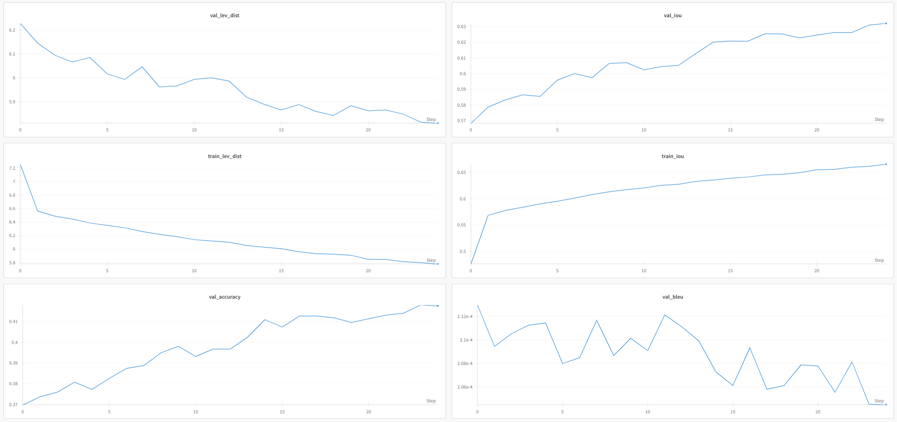
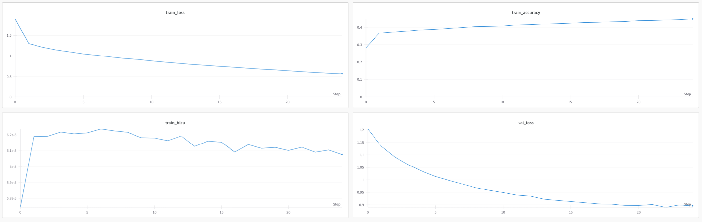

# Method Name Generation

- Chosen model: **codet5p-220m**
- Metrics: accuracy, BLEU, Intersection over Union, Levenstein distance

## Dataset Gathering

To collect necessary methods the repository of intellij-community was used.
The supported languages of the model are Java, Javascript, Python, C++, C, php, Go, ruby.
To get methods from files the tree_sitter library was used.

The final dataset consists of pairs of **Method body, signature and keyword defining the start of function definition**
and **the actual name of method**. For example, for method

```python
def add(a, b):
    return a + b
```

the strings `def <extra_id_0>(a, b):\n    return a+b` and `add` would be in dataset.

`<extra_id_0>` denotes a place of the completion.

As the result more than 10000 data points were gathered.

## Training Environment

For the model training the remote GCloud Machine with T4 was used. Also the simplest GitHub action was set for automatic
pull of the code to the remote machine. To build learning curves and track mentioned metrics the wand.ai was used.

## Result evaluation:

Not fine-tuned model showed following results on test sub-dataset:

- _BLEU Score_: 0.0003388617485723149
- _Accuracy_: 0.0
- _IoU Score_: 0.3085751428863999
- _Levenshtein Distance_: 9.044973544973544

After fine-tuning:

- _BLEU Score_: 0.0004778488939855917
- _Accuracy_: 0.4312169312169312
- _IoU Score_: 0.6401083534502665
- _Levenshtein Distance_: 6.220899470899471

As you can see the results became better. The learning curves and the change of metrics can be seen below:





## Remarks

- The BLEU Score is not informative in this case weil the length of generated sequence is too short
- To improve the quality of the solution it can be useful to obtain more broad context, e.g. not only predict name from
  method body but also from the "features" around it (class if it is a method, functions around, analyze the places of
  function calling)
- Also to improve the CI/CD it is possible to parse the parameters of the train run from the commit message or special
  configuration file. Also the automatic re-training can be developed if the new data point appeared (I didn't do it
  because it is out of the task scope imo).
